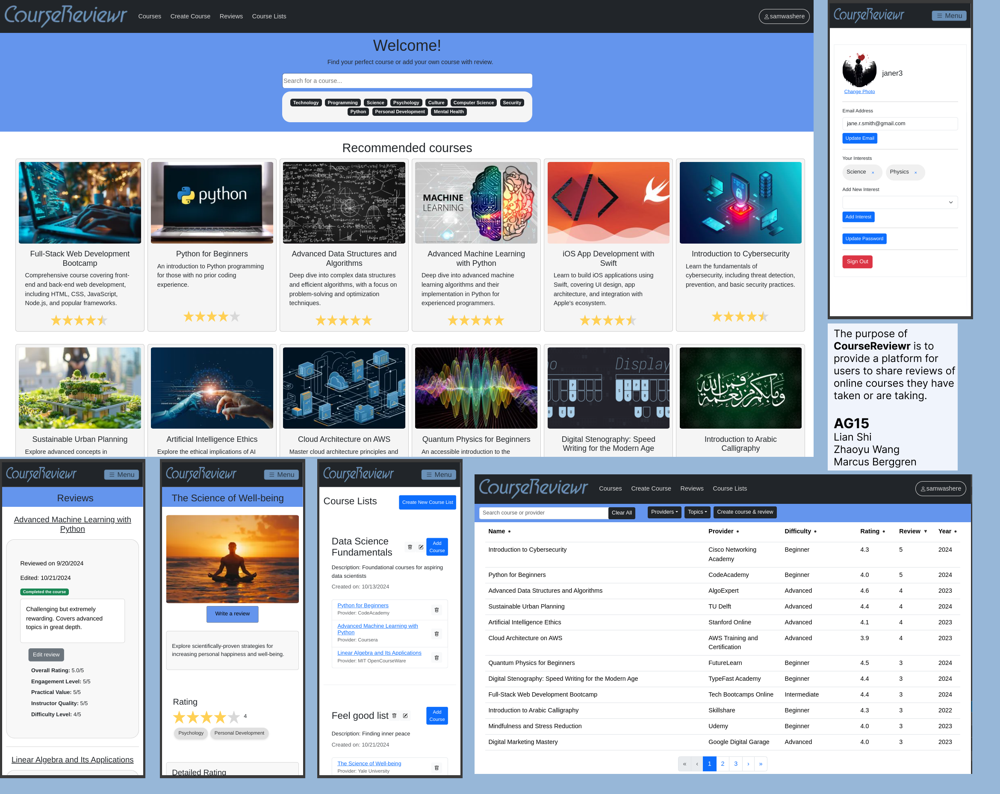

# CourseReviewr

## System Definition (MS0)

### Purpose

This system allows users to share and view reviews about online courses they have taken or are taking. Users can add courses from different course providers and rate them, optionally with leaving comments.

Users are able to create different lists with courses they want to enroll in or courses they have already taken, as well get recommendation of courses that are in their area of interest.

### Pages

* Homepage: Displays various recommended courses depending on a user's interests (if any, or if logged in), the amount of reviews and the review rating of each course. Underneath the courses are the latest reviews made. There is a typeahead search bar for findind existing courses and possibility to select popular topics to filter on.

* Courses page: A page where all courses are listed, sorted on review account but possible other sorting options are on course provider, difficulty, average rating, amount of reviews and release year. There's a search bar and possibility to filter on providers and topics as well, depending on preference.

* Single course page: All the detailed information about one course, including rating and all the reviews listed underneath.

* Create course page: Here you fill in all the necessary information to create a course. Editing a course after creation is not possible at release 1 so there are several mandatory fields to fill in.

* Create review page: A page for creating a review of a course. A created review is stored in each course page and in the users reviews page.

* Reviews page: This is the page where a user has all their reviews listed. The reviews may be edited and you can visit a reviewed course from there.

* Course list page: A page where a user can store various different course lists with courses, following their interests or for future note.

* Profile page: Here the user can change contact information such as photo, e-mail, interests and update password.

* Sign in & Register pages: Basic sign in and register pages. You need to be signed in order to be able to create a course, create a review, enter reviews page and course lists page.

### Entity-Relationship (ER) Diagram

## Advanced feature for the project

Using Amazon Simple Storage Service (S3) to store and retrieve images for our system, users can upload images for a course, when reviewing course, and in user profile.

### Backend Implementation

1. AWS S3 Configuration:
   * AWS SDK was used to interact with S3.
   * AWS credentials (e.g., accessKeyId, secretAccessKey, region) are configured using environment variables.
2. API Endpoints:
   * Generate Upload URL (generateUploadUrl): Generates a signed URL to allow the client to upload an image to S3 directly.
   * Generate Download URL (generateDownloadUrl): Provides a signed URL for downloading the image from S3.
   * Delete Object (deleteOneObject): Deletes an image from S3, typically called when a profile photo or course photo is updated to remove old images and save space.
3. The endpoints are exposed in the aws.routes.js file to handle requests such as generating URLs or deleting objects. The AWS-related functionality is encapsulated in the aws.controller.js.
4. AWS S3 Bucket Operations:
   * Images are uploaded using pre-signed URLs generated by the backend. These URLs allow the client to interact with S3 directly for uploading without exposing secret keys.
   * Images are deleted by calling the deleteOneObject endpoint when a new image replaces an old one.

### Frontend Implementation

1. Image Upload:
   * Image Resizing: Before uploading, images are resized on the client-side using a canvas element. This reduces image size, improves upload speed, and limits the image dimensions (e.g., 300x200).
   * API Integration:
     * The frontend component uses Api.js to request an upload URL by calling the /aws/generate-upload-url endpoint.
     * Once the signed URL is obtained, the image is uploaded directly to AWS S3 using an HTTP PUT request.
   * Form Handling: For profile pictures, once the image is uploaded to S3, the image key is saved to the user’s profile via an API call.
2. Image Retrieval:
   * Image Display Component: S3ImageDisplay.vue is used to display images from S3.
     * If a valid image key exists, a download URL is fetched from S3 using the /aws/generate-download-url endpoint, and this URL is used as the src for the image.
     * If no image key exists, a placeholder image is shown.
3. Image Deletion:
   * When an image is updated (e.g., profile picture), the old image is deleted by calling the /aws/delete-object endpoint with the key of the old image.

### Database Implementation

1. Storing Image References:
   * The database stores the S3 keys as string for each image.
   * For example:
     * A user's profile image key (user.photo) is stored in the user document.
     * A course image key (course.photo) is stored in the course document.
2. Associations:
   * When a user or course photo is updated, the S3 key for the new image is saved in the database, replacing the old key.
   * This ensures that the database maintains a reference to the correct image in S3, and the frontend can easily retrieve the associated image using these keys.

## Teaser (MS3)
